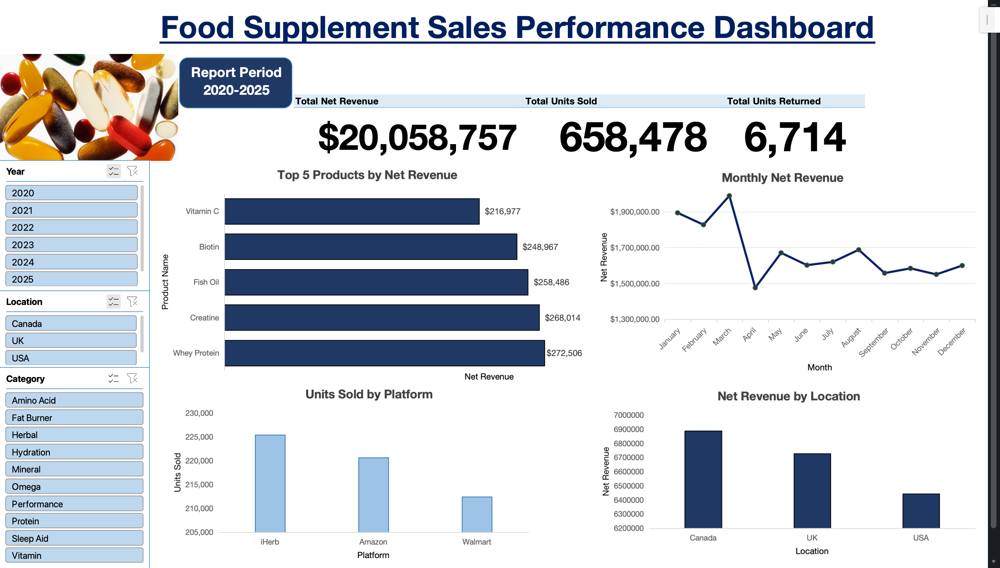
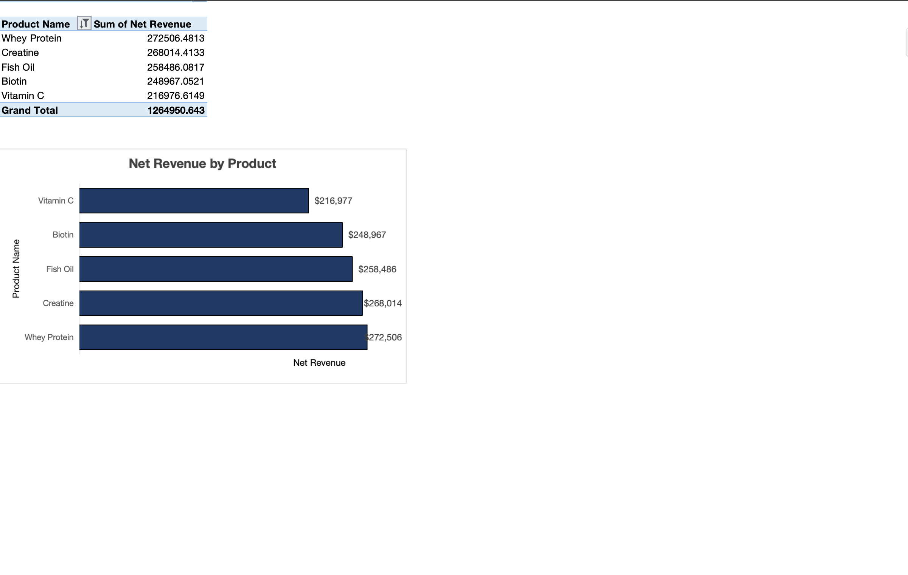
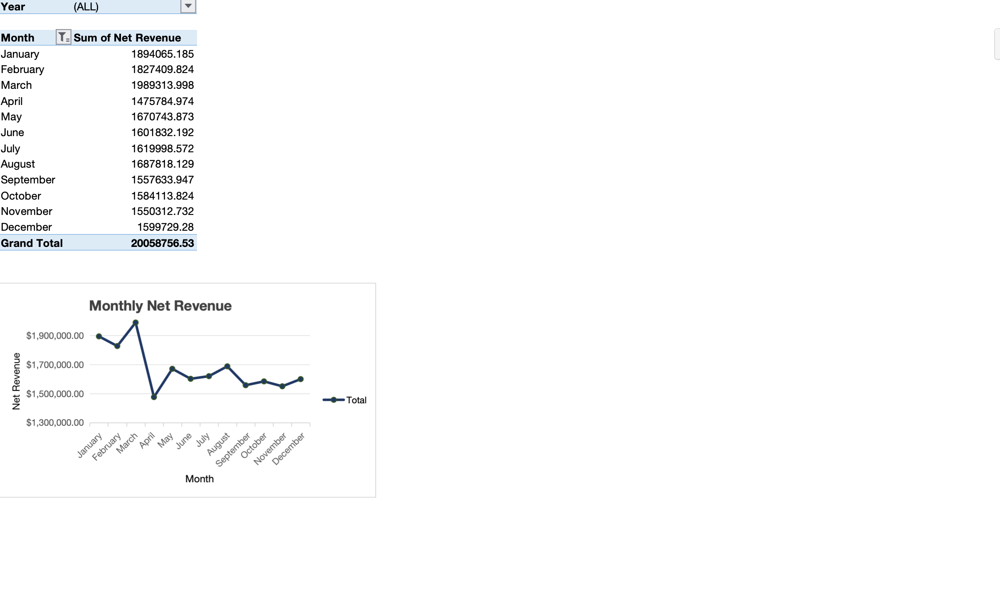
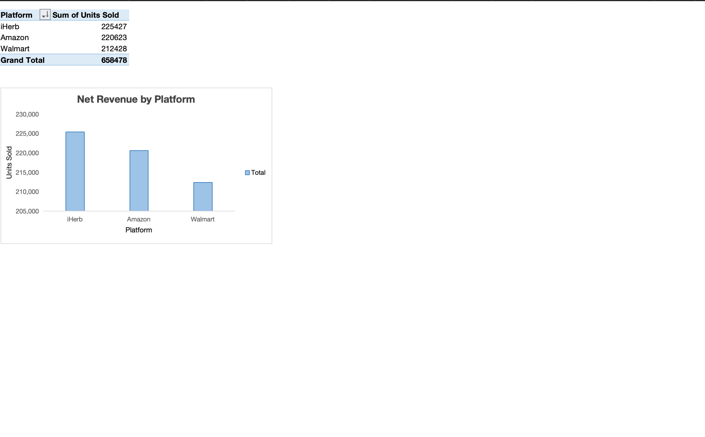
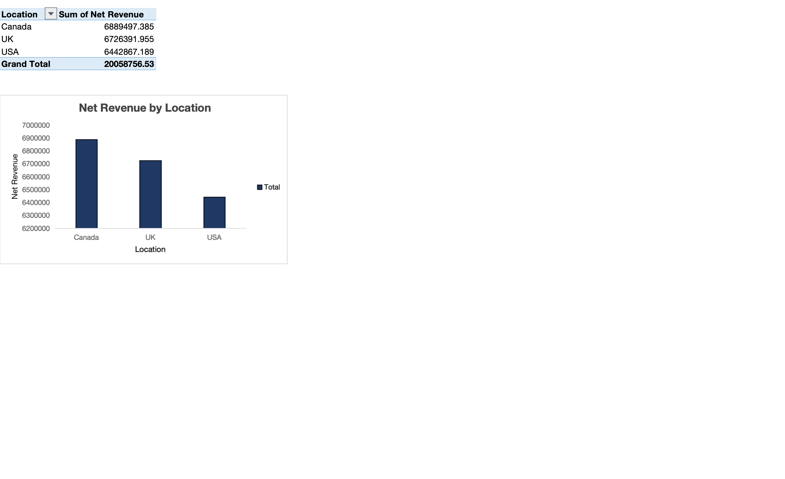

# 📊 Supplement Sales Analysis in Microsoft Excel

An interactive Microsoft Excel dashboard designed to analyze food supplement sales data and present business insights through data cleaning, PivotTables, PivotCharts, KPIs, and interactive slicers.

## Dashboard Preview

## Project Objective

This project examines sales performance to identify top-performing products, compare sales across locations and platforms, track monthly revenue trends, and support data-driven business decisions.

## Business Questions

The dashboard answers the following business questions:

### 1. Which products generate the highest net revenue?
### 2. How does monthly net revenue change throughout the year?
### 3. Which sales platform records the highest sales volume?
### 4. Which locations contribute the largest share of total net revenue?

## Dataset

View dataset https://www.kaggle.com/datasets/zahidmughal2343/supplement-sales-data 

The dataset contains transactional sales information with the following columns:

- Date
- Product Name
- Category
- Units Sold
- Price
- Revenue
- Discount
- Units Returned
- Location
- Platform

- **Rows:** 4,384
- **Columns:** 10 (original dataset)
- **Time Period:** Five years

---

## Data Cleaning

Before performing the analysis, the dataset was cleaned and validated in Microsoft Excel to ensure the accuracy, consistency, and reliability of the results.

The following data cleaning steps were completed:

- Verified the dataset structure, confirming **4,384 records** and **10 original columns**.
- Confirmed that all column names were correctly labeled and that the data types were appropriate for each field.
- Checked for duplicate records and found **no duplicate transactions**.
- Inspected all columns for missing values.
- Identified **89 blank values** in the **Discount** column. Based on the dataset structure, these represented transactions with no discount applied and were replaced with **0**.
- Validated the **Revenue** column by confirming that the recorded revenue matched the calculation **Units Sold × Price**, indicating that discounts were stored separately and were not deducted from the recorded revenue.
- Reviewed numeric fields for invalid values, including negative values, zero values, and other logical inconsistencies that could affect the analysis.
- Created additional calculated fields to support business analysis:
  - **Month** – for monthly sales trend analysis.
  - **Year** – to distinguish transactions across multiple years.
  - **Net Revenue** – to estimate revenue after applying discounts.
 - Saved the cleaned dataset as the analysis-ready version for dashboard development.

The cleaned dataset served as the foundation for all subsequent PivotTables, visualizations, and business insights presented in this project.

---

## Dashboard Features

The interactive dashboard provides a summary of supplement sales performance through key performance indicators (KPIs), visualizations, and interactive filters. It allows users to explore sales data from different perspectives and quickly identify business trends.

### Key Performance Indicators (KPIs)

- **Total Net Revenue** – Displays the total revenue generated after discounts.
- **Total Units Sold** – Shows the overall sales volume.
- **Total Units Returned** – Measures the total number of returned products.

### Interactive Filters

The dashboard includes slicers that allow users to filter the analysis by:

- Year
- Category
- Location

### Dashboard Visualizations

The dashboard consists of four interactive charts:

1. Top 5 Products by Net Revenue
2. Monthly Net Revenue Trend
3. Sales Volume by Platform
4. Net Revenue by Location

---

## Answer to the Questions

### 1. Which products generate the highest net revenue?

**Finding**

The analysis shows that **Whey Protein** generated the highest net revenue among all products, making it the strongest revenue contributor. The Top 5 Products chart highlights the highest-performing products and the gap between them.

### 2. How does monthly net revenue change throughout the year?

**Finding**

Monthly net revenue fluctuates throughout the year, with **March** recording the highest revenue and **April** the lowest. These trends can help the business identify seasonal demand and improve sales planning.

### 3. Which sales platform records the highest sales volume?

**Finding**

Among all sales platforms, **iHerb** recorded the highest number of units sold. A platform for health and wellness products. This suggests that the platform is a major sales channel and could be prioritized for future marketing and inventory planning.

### 4. Which locations contribute the largest share of total net revenue?

**Finding**

The location analysis shows that **Canada** contributed the largest share of total net revenue, indicating a strong market presence in that region.

---

## Tools Used

- **Microsoft Excel** – Data cleaning, PivotTables, PivotCharts, KPIs, slicers, and dashboard development.
- **Git** – Version control.
- **GitHub** – Project hosting and portfolio presentation.

---

## How to Use

1. Clone or download this repository.
2. Open `Interactive_Food_Supplement_Sales_Dashboard.xlsx` in Microsoft Excel.
3. Go to the **Dashboard** worksheet.
4. Use the **Year**, **Category**, and **Location** slicers to interact with the dashboard.
5. Explore the charts and KPIs to answer the business questions.

---

## Conclusion

This project demonstrates how Microsoft Excel can be used to transform raw sales data into an interactive dashboard that supports business decision-making. By combining data cleaning, analysis, and visualization techniques, the dashboard provides insights into product performance, revenue trends, sales channels, and regional performance.

---

## Author

**Nwana Peace Ukamaka**

- GitHub: https://github.com/nwana-peace
- Medium: *https://medium.com/@nwanapeace12*
